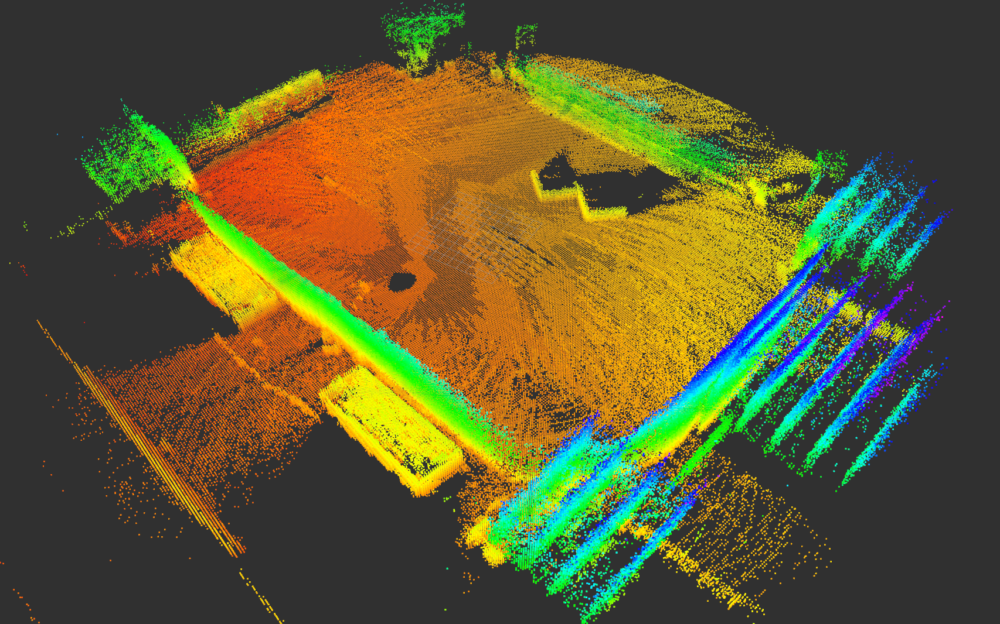
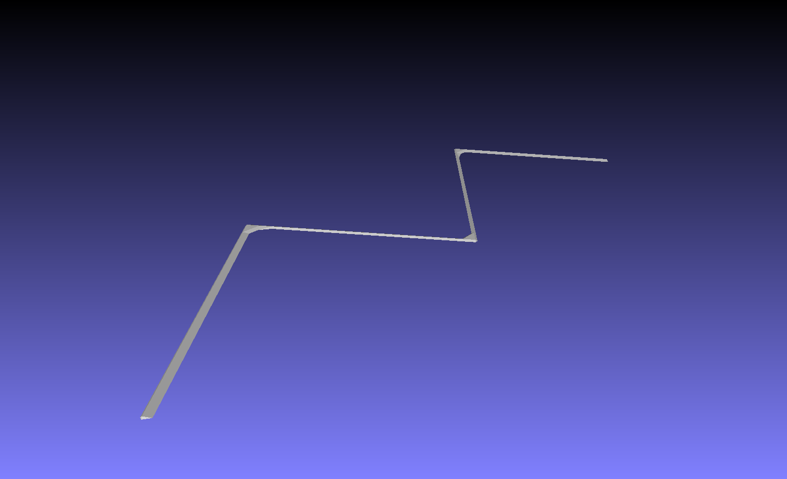
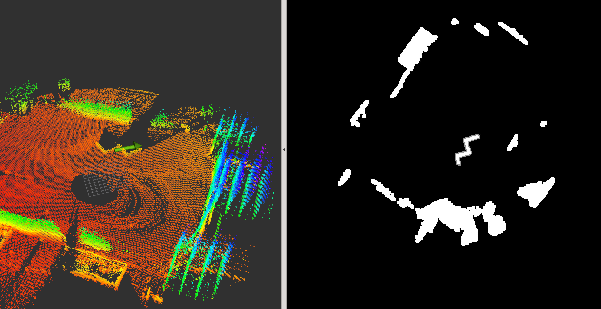

# PCL Pattern Matching

This repository uses PCL and OpenCV libraries to perform 3D pattern matching on an unorganized pointcloud. Inputs are an unorganized pointcloud and a 3D model of a pattern. Output is the pose of the matched pattern wrt. the pointcloud frame. Pattern needs to have a recognizable shape in the horizontal plane.

## Dependencies

Install all the dependencies as follows.

```bash
sudo apt install libopencv-dev libpcl-dev ros-melodic-mavros libgeographic-dev
```

To obtain a map pointcloud the following packages were used with a Velodyne VLP-16 LiDAR sensor.

* [cartographer](https://github.com/larics/cartographer_ros)
* [cartographer_ros](https://github.com/larics/cartographer_ros/tree/erl)

## MBZIR dataset

[Link](https://ferhr-my.sharepoint.com/:f:/g/personal/lmarkovic_fer_hr/EpsQbdSsHKxMrks9z5_Y69QBdrwx8bnhJUvFTZeasxTHxA?e=qW8aKf) to the MBZIRC ROS bags containing LiDAR measurements and map building bags. The goal is to detect the a zig-zag wall pattern. The generated map cloud and wall pattern used for matching is located in *resources/wall_pattern_upscaled.ply*. The map is obtained with a Velodyne VLP-16 LiDAR through the [cartographer](https://github.com/larics/cartographer_ros) module.

<p float="left">
    
    
</p>

### Detection demonstration

On the left the green arrow indicates the pose of the target 3D model pattern, while on the right side a top-down projection of the organized pointcloud is shown with an outlined pattern match.

```bash
roscore
rosbag play ch2_bag_2020-02-22-18-42-09.bag
rosrun pcl_pattern_matching pattern_matching_node __ns:=blue
```


